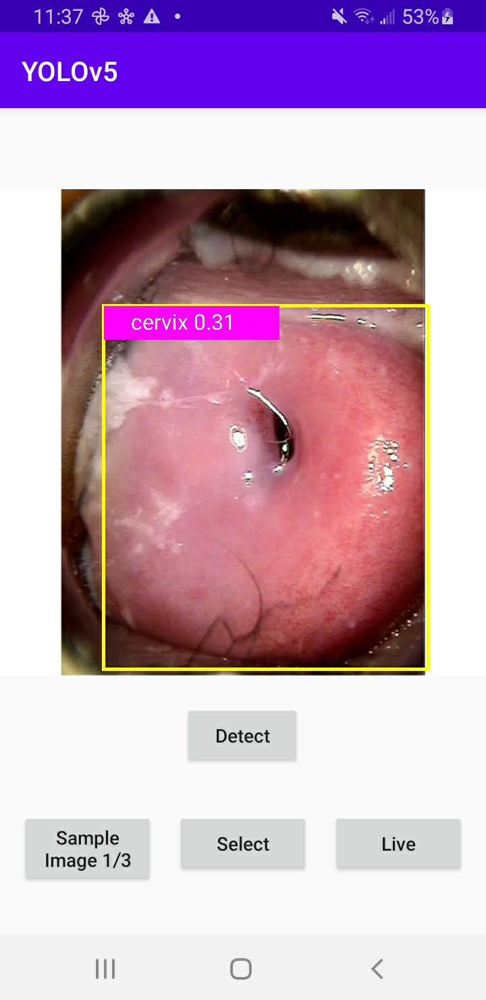

# Cervix Detection with YOLOv5 on Android

## Introduction

[YOLO](https://pjreddie.com/darknet/yolo/) (You Only Look Once) is one of the fastest and most popular object detection models. [YOLOv5](https://github.com/ultralytics/yolov5) is an open-source implementation of the latest version of YOLO (for a quick test of loading YOLOv5 from PyTorch hub for inference, see [here](https://pytorch.org/hub/ultralytics_yolov5/#load-from-pytorch-hub)). This Cervix Detector with YOLOv5 Android sample app uses the PyTorch scripted YOLOv5 model to detect the cervix on images.

## Prerequisites

* PyTorch 1.9.0 or later (Optional)
* Python 3.8 (Optional)
* Android Pytorch library pytorch_android_lite:1.9.0 and pytorch_android_torchvision:1.9.0
* Android Studio 4.0.1 or later

## Quick Start

To Test Run the Cervix Detection Android App, follow the steps below:

### 1. Use existing pretrained model

The model file `best.torchscript.ptl` is already stored in the `cervix-demo-app/CervixDetection/app/src/main/assets` folder - if you want to use this, skip the rest of this step and go to step 2 directly.

Be aware that the downloadable model file was created with PyTorch 1.9.0, matching the PyTorch Android library 1.9.0 specified in the project's `build.gradle` file as `implementation 'org.pytorch:pytorch_android_lite:1.9.0'`. If you use a different version of PyTorch to create your model by following the instructions below, make sure you specify the same PyTorch Android library version in the `build.gradle` file to avoid possible errors caused by the version mismatch. Furthermore, if you want to use the latest PyTorch master code to create the model, follow the steps at [Building PyTorch Android from Source](https://pytorch.org/mobile/android/#building-pytorch-android-from-source) and [Using the PyTorch Android Libraries Built](https://pytorch.org/mobile/android/#using-the-pytorch-android-libraries-built-from-source-or-nightly) on how to use the model in Android.

### 2. Build with Android Studio

Start Android Studio, then open the project located in `cervix-demo-app/CervixDetection`

### 3. Run the app

Select an Android emulator or device to run the app. You can go through the included example test images to see the detection results. You can also select a picture from your Android device's Photos library, take a picture with the device camera, or even use live camera to do object detection - see this [video](https://drive.google.com/file/d/11apbwkzEKMHeHtb1-kZArWTgh8FDre_m/view?usp=sharing) for a screencast of the app running.

An example image and the detection result:

